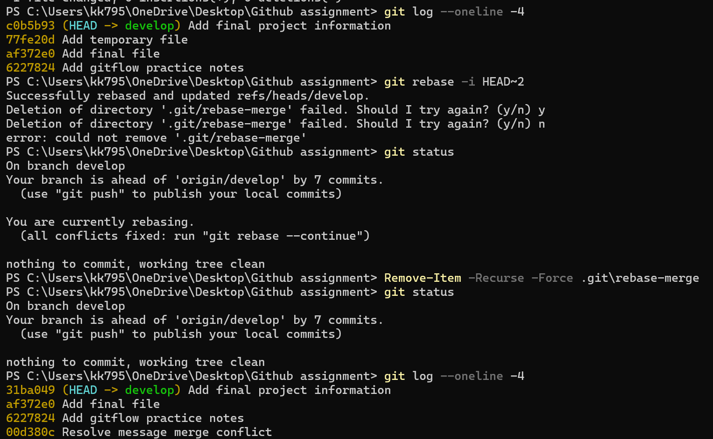
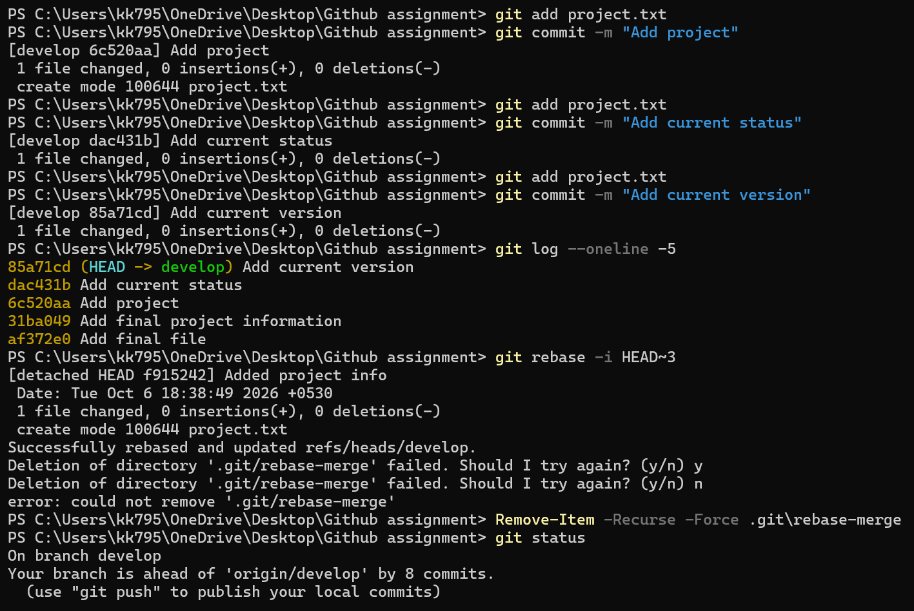
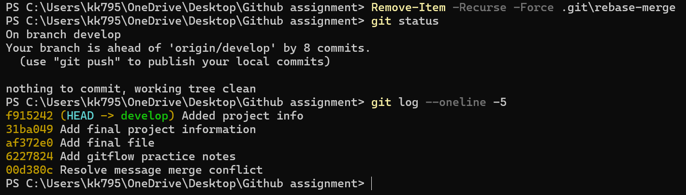
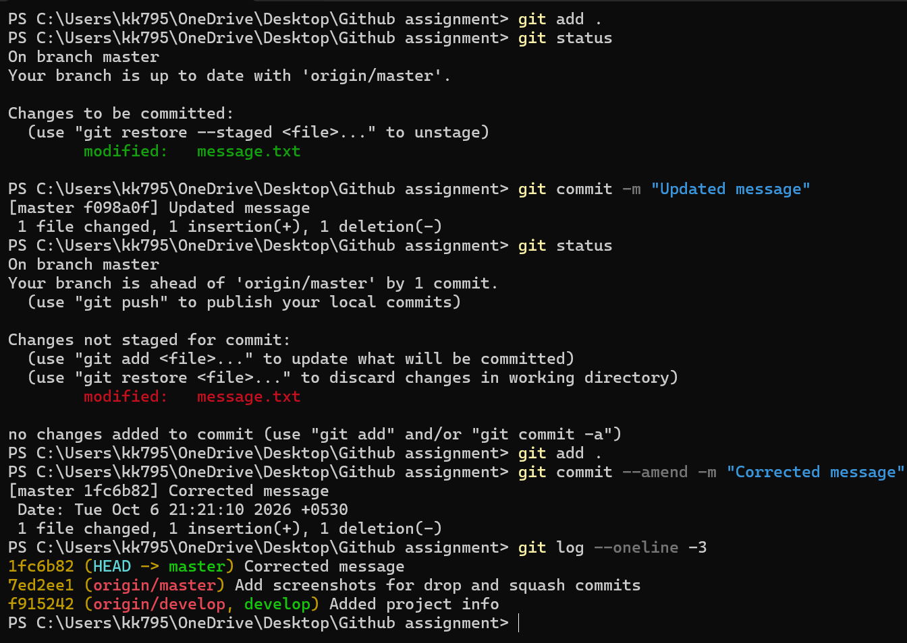
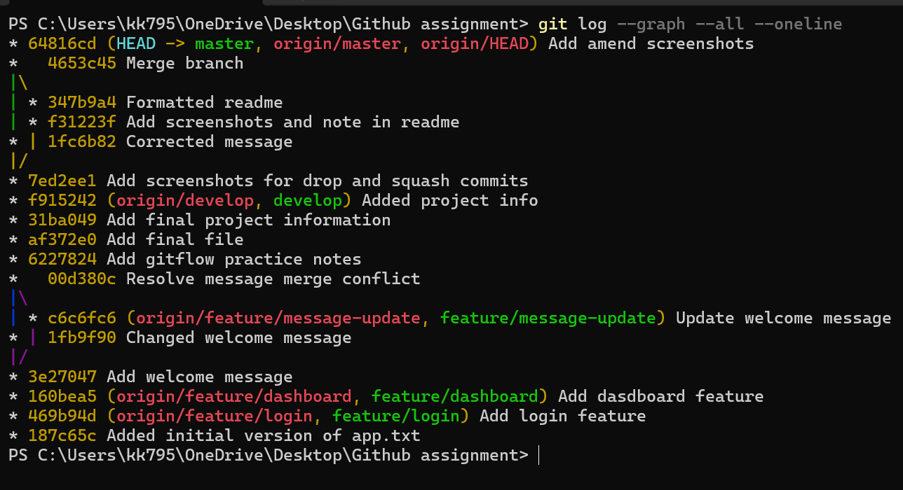

## Screenshots

### Undo Commit

### Squash Commit

### Amend Commit

### Graph

## Note

During the rebase operations, Git sometimes reported an error while deleting the `.git/rebase-merge` directory. This was caused by the repository being located inside OneDrive, which was temporarily locking the files. The `drop`/`squash` operations themselves were completed successfully; only the cleanup of the rebase directory failed.I forced-deleted the leftover directory as in the screenshots above.
